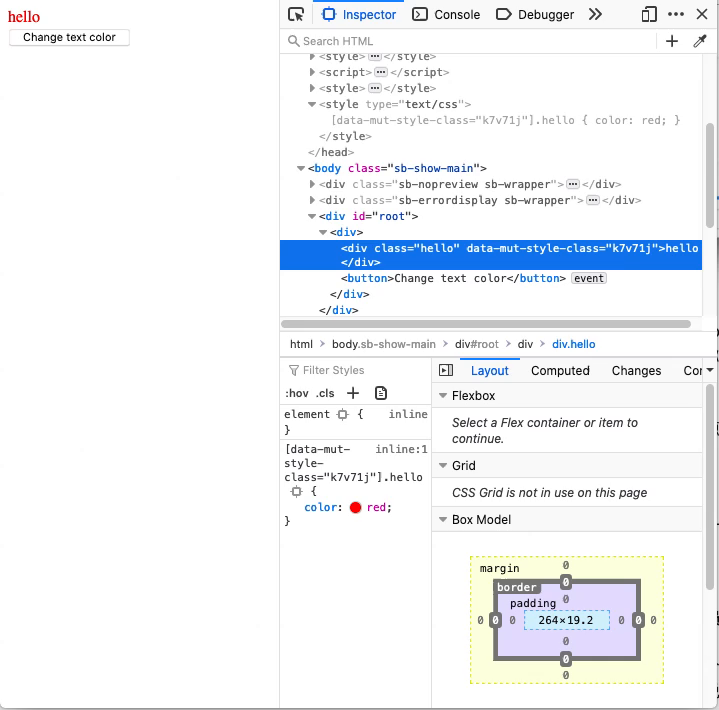

# Mut Style
Achieve styled component using mutable `<style>` tag.

## Usage

```tsx
// This component will transfer the css properties rules to css content,
// and insert the css into <style> tag.
// Current css will work in the wrapped scope.
export function Foo() {
    const [color, setColor] = useState('red');

    return (
        <div>
            <MutStyle css={{ '.hello': { color } }}>
                <div className="hello">hello</div>
            </MutStyle>
            <button
                onClick={() => {
                    setColor(color === 'red' ? 'blue' : 'red');
                }}
            >
                Change text color
            </button>
        </div>
    );
}
```
The above code will behavior like this :




## Props

Only one prop `css` is needed.

`css` prop declaration :
```ts
export interface IMutStyleRules {
    [selector: string]: CSSProperties; // CSSProperties is React internal style interface.
}
```
